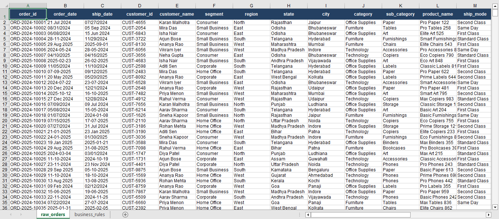
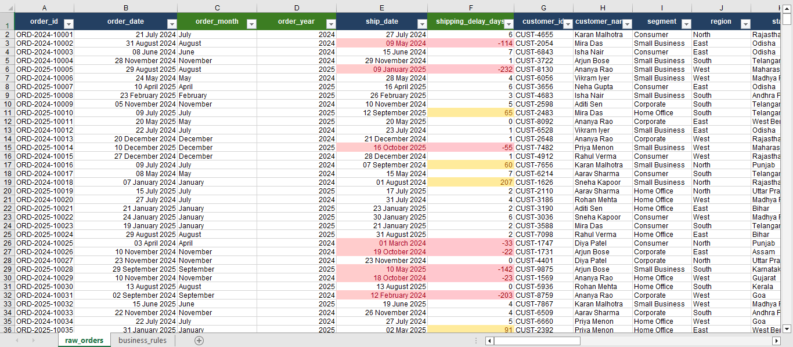
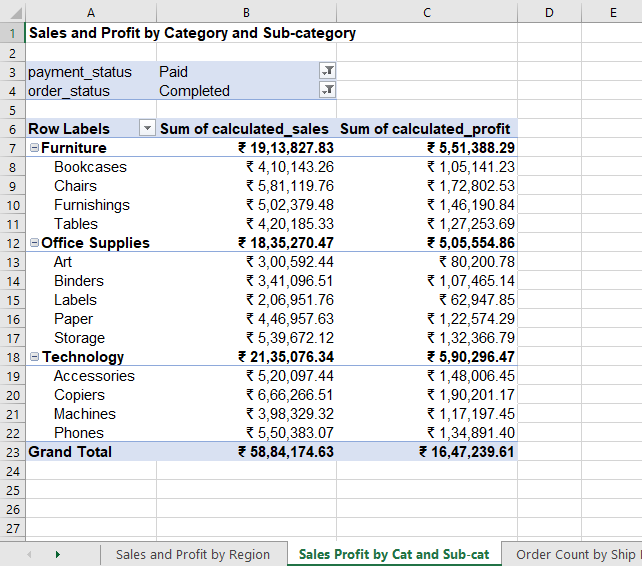
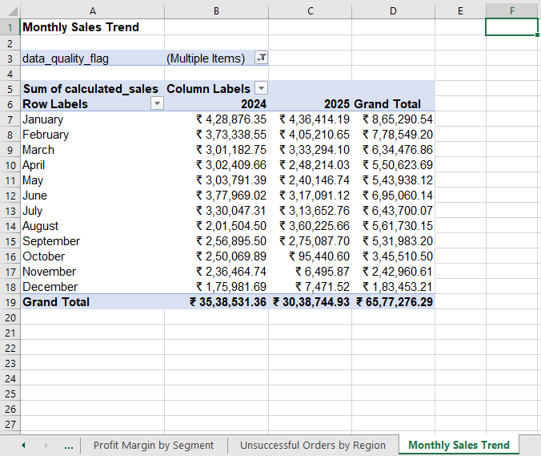

# Part 1: Business Data Cleaning, Validation & Excel Reporting

### 1. Problem Summary
To clean, validate and report order-level sales data containing issues such as inconsistent text formatting, date format problems, duplicate records, missing values, invalid discounts, calculation mismatches, and order status inconsistencies. And to create summary reports that can be used for business review.
______
### 2. Dataset Description

| Column Name | Data Type | Description |
| :--- | :--- | :--- |
| `order_id` | IDs | Primary order identifier (some duplicate ids) |
| `order_date` | Date | Date order was placed |
| `ship_date` | Date | Date order was shipped |
| `customer_id` | IDs | Unique customer identification |
| `customer_name`| Text | Customer names |
| `segment` | Text | Different Market segments (Consumer, Corporate, Home Office, Small Business) |
| `region` | Text | East, West, North and South |
| `state` | Text | Indian states |
| `city` | Text | Regional Indian city names |
| `category` | Text | Major product category (Furniture, Office Supplies, Technology) |
| `sub_category` | Text | Specific product subtypes |
| `product_name` | Text | Complete Product title. |
| `ship_mode` | Text | Different shipping tiers (Same Day, First Class, Second Class, Standard Class) |
| `quantity` | Integer | units ordered per product |
| `unit_price` | Decimal | Unit price of the product |
| `discount` | Mixed (decimal/percentage) | Discount percentages in decimals |
| `sales` | Decimal | Orders sales |
| `cost` | Decimal | product cost |
| `profit` | Decimal | profits from orders |
| `payment_status`| Text | Transaction status ("Failed", "Paid", "Pending", "Refunded"). |
| `order_status`  | Text | Operational order status ("Cancelled", "Completed", "Returned"). |
_______
### 3. Tools Used
- **Microsoft Excel**

- **Excel Functions Applied:** `TRIM`, `PROPER`, `COUNTIF`, `SUM`, `AVERAGE`

- **Data Tools Used:** Text to Columns (DMY wizard parsing), Pivot Tables, Value/Label filters, Conditional Formatting.
_________
### 4. Cleaning Steps Performed
1.  **Text Field Standardization:** Applied `=TRIM(PROPER(cell))` across `customer_name`, `segment`, `region`, `state`, `city`, `category`, `sub_category`, `ship_mode`, `payment_status`, and `order_status` to normalise mixed case anomalies and leading/trailing space.

2.  **Date Parsing:** Used the *Text to Columns* to convert text stored dates uniform date data into a long date standard (`dd-mmmm-yyyy`).

3.  **Calculations:** Created additional columns for calculations:
    * `shipping_delay_days`: `=ship_date - order_date`
    * `cleaned_discount`: Standardized decimals (converting text percentages like "70%" to `0.70` and blanks to `0`).
    * `calculated_sales`: `=quantity * unit_price * (1 - cleaned_discount)`
    * `calculated_profit`: `=calculated_sales - cost`
    * `profit_margin`: `=calculated_profit / calculated_sales`

4.  **Data Quality:** Added 2 columns for tracking data quality:
    * `data_quality_notes`: descriptive notes detailing invalid and warning records (e.g., *"invalid shipping record, missing region"*).
    * `data_quality_flag`: to flag the records by buckets: `Clean`, `Warning`, or `Invalid` to streamline filters.
_______
### 5. Business Rules Applied
**Raw file** - Do not overwrite raw_orders.xlsx. Create cleaned_orders.xlsx separately.

**Missing region** - Fill as Unknown and flag in quality report.

**Missing ship_mode** - Fill as Unknown and flag in quality report.

**Missing discount** - Treat as 0 only if all other sales fields are valid; otherwise flag.

**Discount** - Flag negative discounts and unusually high discounts as invalid.

**Cancelled/Failed/Refunded** - Do not include non-completed/failed/refunded records in completed-sales summaries.

**Date sequence** - Flag ship_date earlier than order_date.

**Duplicates** - Remove exact duplicate copies; flag conflicting duplicate order IDs.

**Calculated fields** - Create calculated_sales, calculated_profit, profit_margin, shipping_delay_days, order_month, order_year, and data_quality_flag.

**Documentation** - Document cleaning decisions and assumptions in cleaning_log.md.
_______
### 6. Summary of Data Quality Issues Found
- **Exact Duplicate Rows Removed:** 20 records.

- **Conflicting Order ID Rows Flagged:** 24 records (marked as `Invalid`).

- **Missing Values Found & Resolved:** 25 missing regions, 21 ship modes were found and fillied in as "Unknown". 18 blanks discount cells were filled as "0" (zero).

- **Invalid Shipping Anomalies:** 194 occurrences where ship date was before order date.

- **Calculation Mismatches:** Calculation mismatches discovered via `calculated_sales - sales` (76 records) and `calculated_profit - profit` (70 records).
_______
### 7. Summary of Final Pivot Reports
1. **Sales and Profit by Region:** The South region led gross revenue generation at ₹15,52,993.99, while the West region yielded the highest profitability at ₹4,28,325.50. regions not recorded ("Unknown") accounted for ₹1,85,049.58 in sales. Total net revenue stands at ₹58,84,174.63 with a net profit of ₹16,47,239.61.

2. **Sales and Profit by Category and Sub-category:** Technology is the highest grossing business division with ₹21,35,076.34 in sales and ₹5,90,296.47 in profit, largely due to Copiers (₹6,66,266.51). Followed by Furniture closely at ₹19,13,827.83, and Office Supplies generated ₹18,35,270.47.

3. **Order Count by Ship Mode:** Order volume is pretty balanced, with Standard Class as the largest tier at 242 orders, followed by First Class (223), Second Class (222), and Same Day (204). Missing ship modes 21 orders are flagged as "Unknown".

4. **Profit Margin by Customer Segment:** Profitability is uniform across the all the segments, averaging a 29.40% profit margin overall. The Home Office segment stands at the top with 29.68%, while the Consumer segment represents the baseline at 29.19%.

5. **Refunded/Cancelled/Failed Orders by Region:** Out of 224 identified transactional complications, Returned orders (118) and Cancelled orders (106) represent severe operational issues. The North region is has the highest problems accumulating 62 total disruptions.

6. **Monthly Sales Trend:** The sales across 2 years is a total of ₹65,77,276.29. While 2024 generated a strong sales of ₹35,38,531.36, in 2025, the performance data shows a decrease in revenue in Q4, dropping from ₹3,60,225.66 in August to just ₹7,471.52 by December.
_______
### 8. Key Business Insights
- While the North region generates healthy sales (₹12,69,521.74), it suffers from some operational inefficiencies. It accounts for the highest amount of transactional failure in the company (62 issues), mostly by 37 cancelled orders and 12 failed payments. The company must audit the North region's systems to stop this.

- Sales in 2025 were normal until October (₹95,440.60), after which revenue collapsed completely in November (₹6,495.87) and December (₹7,471.52). There is either a massive technical failure in data or an unresolved issue.

- Copiers (Technology) is high value asset, bringing in ₹1,90,201.17 in profit on its own. Similarly, Chairs take up majority of the Furniture category, earning more than Bookcases and Tables with ₹1,72,802.53 in profit. The comany should focus more toward these two sub-categories.

- Regions recorded as "Unknown" is a significant problem. It accounts for ₹1,85,049.58 in sales and ₹61,094.31 in profit. But, because these points cannot be determined, the company does not know from which area around 3% of its profitable sales are actually originating.

- Customers are utilizing "Same Day" shipping (204 orders) almost as much as "Standard Class" (242 orders). Because premium same day logistics carry much higher carrier costs, company should review the shipping fee pricing strategy to ensure the business is charging an appropriate premium for immediate fulfillment rather than eating the freight margin.
________
### 9. Assumptions and Limitations
- It was assumed that the 20 duplicate records discovered in the raw data were the result of automated system glitches. Removing them was assumed to protect the dataset integrity without deleting actual individual orders.

- For the 24 duplicate order_id values, it was assumed that cross system data corruption had occurred. Because it was impossible to verify which entries were accurate, all 24 records were assumed to be untrustworthy and flagged as Invalid, and not included in revenue calculations.

- It was assumed that the 37 pending transactions listed in the payment status haven't fully completed transaction processes. Though they are valid, they were intentionally excluded from revenue calculations.

- Some geographic data was missing and regions were recorded as "unknown", it is impossible to map the profitable transactions back to their origins for localized market analysis.

- Valid Discount limits were not given, so 70% (0.70) and 85% (0.85) were labelled as Invalid discounts. All Discounts below 70% (0 to 69%) are assumed to be valid discounts.
________
### 10. Screenshots Included
1. **Raw Dataset Preview**

2. **Cleaned Dataset Preview**

3. **Pivot Table: Sales and Profit by Category and Sub-category**

4. **Pivot Table: Monthly Sales Trend**

